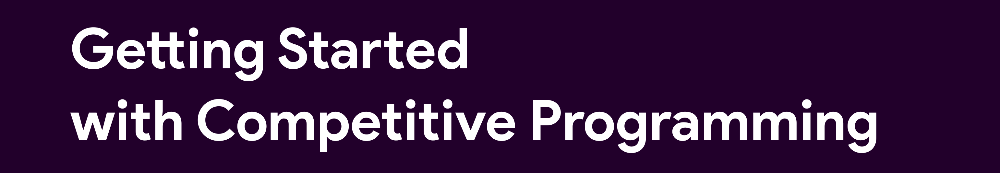

 
 

<h2 align="center">👉 A Collection of Solutions to Competitive Programming Problems 👈</h2>

 

 
 ## Introduction
  The aim of competitive programming is to write source code of computer programs which are able to solve given problems. A vast majority of problems appearing in programming contests are mathematical or logical in nature.

Competitive programming is a mind sport usually held over the Internet or a local network, involving participants trying to program according to provided specifications. Contestants are referred to as sport programmers.

:star2: Star it 
:fork_and_knife:Fork it
:handshake: Contribute to it!

## Languages 
- Python
- C++
- Java
- SQL

## Support

Star,Share,Add Your solutions,MAKE PR 
